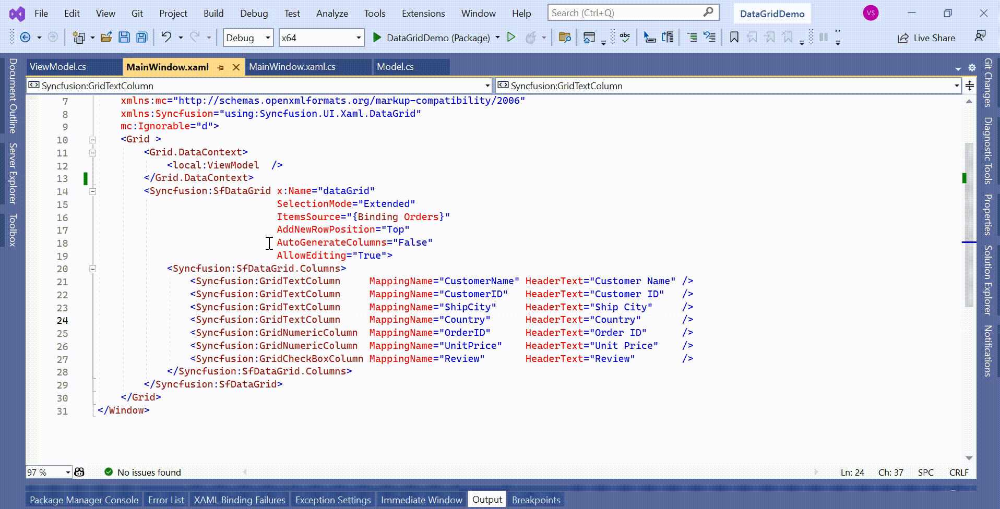

# How to validate the AddNewRow value based on existing records in WinUI DataGrid (SfDataGrid)?

You can validate the newly adding row value based on the existing records by using the [CurrentCellValidating](https://help.syncfusion.com/cr/winui/Syncfusion.UI.Xaml.DataGrid.SfDataGrid.html#Syncfusion_UI_Xaml_DataGrid_SfDataGrid_CurrentCellValidating) event in [WinUI DataGrid](https://www.syncfusion.com/winui-controls/datagrid) (SfDataGrid).

 ```C#

 //Event subscription
 this.dataGrid.CurrentCellValidating += OnCurrentCellValidating;

 //Event customization
 private void OnCurrentCellValidating(object sender, CurrentCellValidatingEventArgs args)
 {
     // Check whether the row is in add new row or not
     bool isAddNewRow = dataGrid.IsAddNewIndex(dataGrid.SelectionController.CurrentCellManager.CurrentRowColumnIndex.RowIndex);
     if (!isAddNewRow)
         return;

     // Check whether the column is CustomerName or not
     if (args.Column.MappingName == "CustomerName")
     {
         // Get the value of the cell
         var text = args.NewValue.ToString();
         // Check whether the value is already existing or not
         var datacontext = (this.dataGrid.DataContext as ViewModel).Orders;
         var listOfNames = datacontext.Where(e => e.CustomerName.Equals(text)).ToList();
         if (listOfNames.Count > 0)
         {
             args.ErrorMessage = "Entered Name is  already existing";
             args.IsValid = false;
         }
     }
 }       

 ```

  

You can also use the [RowValidating](https://help.syncfusion.com/cr/winui/Syncfusion.UI.Xaml.DataGrid.SfDataGrid.html#Syncfusion_UI_Xaml_DataGrid_SfDataGrid_RowValidating) event to validate the row when the cell is edited. The **RowValidating** event occurs when the edited cells try to commit the row data or lose the focus. 

```C#

 //Event subscription
 this.dataGrid.RowValidating += OnRowValidating;

 //Event customization
 private void OnRowValidating(object sender, RowValidatingEventArgs e)
 {
     // Check whether the row is in add new row or not
     bool isAddNewRow = dataGrid.IsAddNewIndex(dataGrid.SelectionController.CurrentCellManager.CurrentRowColumnIndex.RowIndex);
     if (!isAddNewRow)
         return;

     // Get the value of the column
     var data = e.RowData.GetType().GetProperty("CustomerName").GetValue(e.RowData);

     // Check whether the value is already existing or not
     var datacontext = (this.dataGrid.DataContext as ViewModel).Orders;
     var listOfNames = datacontext.Where(e => e.CustomerName.Equals(data)).ToList();
     if (listOfNames.Count > 0)
     {                
         e.IsValid = false;
         e.ErrorMessages.Add("CustomerName", "Entered Name is  already existing");
     }
 }
 ```

 

Take a moment to peruse the [WinUI DataGrid - Data Validation](https://help.syncfusion.com/winui/datagrid/data-validation) documentation, where you can find about data validation with code examples.
